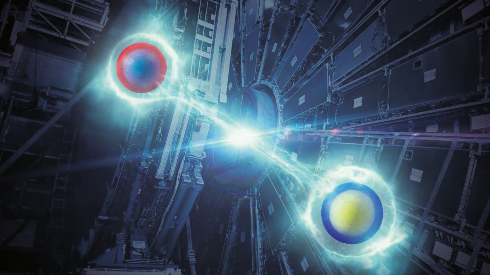

The third [Quantum Observables for Collider Physics](https://indico.cern.ch/event/1603106/) workshop took place at CERN on April 20-24, 2026, bringing together theorists and experimentalists working on quantum-information observables in collider physics.

The programme spanned entanglement, magic, decoherence, Bell tests and quantum state tomography, with discussions connecting particle physics, quantum information science and nuclear theory. The [full agenda](https://indico.cern.ch/event/1603106/timetable/) remains available on CERN Indico.

With Alan Barr, I wrote the [CERN Courier meeting report](https://cerncourier.com/a/all-entangled-around-the-collider/), a short account of the workshop's experimental entanglement results, new theoretical directions and future-collider opportunities.

